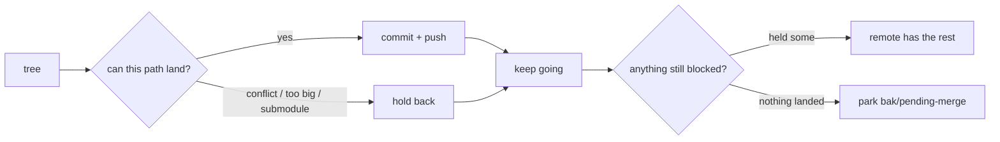

<p align="center">
  
</p>

<div align="center">

<h1 align="center">gitty</h1>
<p align="center"><i><b>diligent backup machine</b></i></p>
<p align="center"><i><b>land everything that can land, every run</b></i></p>

[![GitHub][github-badge]][github-url]
[![npm][npm]][npm-url]

</div>

<br/>

---

<table>
<thead>
<tr>
<th align="left"></th>
<th align="left">Path</th>
<th align="left">You get</th>
<th align="left">Verdict</th>
</tr>
</thead>
<tbody>
<tr>
<td align="left">

</td>
<td align="left">
<ul><li><code>git commit</code> all-or-nothing</li></ul>
</td>
<td align="left">
<ul>
<li>one conflict / huge file / submodule</li>
<li>whole checkpoint dies</li>
<li>remote unchanged</li>
</ul>
</td>
<td align="left">❌<br/><br/>stalls the backup</td>
</tr>
<tr>
<td align="left">

</td>
<td align="left">
<ul><li><code>pull --rebase</code></li></ul>
</td>
<td align="left">
<ul>
<li>same conflict N times</li>
<li>dirty tree mid-flight</li>
<li>other host still stranded</li>
</ul>
</td>
<td align="left">❌<br/><br/>sync theater</td>
</tr>
<tr>
<td align="left">

</td>
<td align="left">
<ul><li><code>gitty</code> drip</li></ul>
</td>
<td align="left">
<ul>
<li>push the clean subset</li>
<li>hold blockers locally</li>
<li>park only if nothing can land</li>
</ul>
</td>
<td align="left">✅<br/><br/>backup continues</td>
</tr>
</tbody>
</table>



## Issue

### ❌ All-or-nothing stall

- one conflicted, oversized, or submodule path parks the whole checkpoint

- the rest of the tree sits unbacked on that machine

- drip: push the clean subset; hold the rest; never stall the backup

### ❌ Dual-machine strand

- laptop + desktop both edit

- N local commits replay against remote -> same conflict N times

- other machine's work never left that machine

### ❌ Checkpoint friction

- agents touch many repos per session

- `add` + `commit` + `push` per repo burns time

- one blocker used to abort the whole run

### ❌ Append ledger false conflicts

- two hosts append different `.ndjson` / `.jsonl` lines

- git sees one slot, two lines -> conflict

- nothing was edited; both lines should keep

<br/>

## Options

| | Bin | Job | When |
|---|---|---|---|
| ![gitty][i-gitty] | `gitty` | drip + holdback -> commit -> push | default backup |
| ![lfs][i-lfs] | `gittylfs` | same + LFS track | big binaries |
| ![git][i-git] | `gittyembedded` | submodules then parent | dirty nested repos |
| ![health][i-health] | `gittyhealth` | report only | inspect / mid-op |
| ![snap][i-snap] | `gittysnap` | snap -> merge -> abort clean | solo multi-machine |
| ![union][i-json] | `gittyunion` | NDJSON union driver | append ledgers |

Separate bins. Same package. Plain `gitty` != `gittysnap`.

<br/>

## Setup

```bash
# scoped package; same bin names
npm i -g @vd7/gitty
```

Optional resolvers (missing file -> empty allowlist -> drip/park, no auto-resolve):

```yaml
per_host:
  paths:
    - registry/system-resource/manifest.json
  globs:
    - snapshots/$(hostname)/**
semantic_union:
  globs:
    - "**/*.ndjson"
    - "**/*.jsonl"
  key_field: ts
```

<br/>

## Usage

| path | do this | get this |
|---|---|---|
| A | `gitty` | drip + holdback checkpoint on remote |
| B | `gittysnap` | snapshot-first solo sync |
| C | `gittyunion install` | NDJSON union merge driver |

### Path A · `gitty`

```bash
# land whatever can land; hold blockers; park only if nothing can
gitty "checkpoint" "$HOME/Documents/a/gitty"
```

`GITTY_PARTIAL=1` default. Park-only: `GITTY_PARTIAL=0`. Bulldoze: `GITTY_FORCE=1`.

### Path B · `gittysnap`

```bash
# both hosts on remote first; rc=2 on conflict; worktree clean
gittysnap
```

### Path C · `gittyunion`

```bash
# union + dedupe + stable-sort for .ndjson / .jsonl
gittyunion install
```

## Output

| signal | meaning |
|---|---|
| partial integrate | resolved subset committed; held paths stay local |
| holdback | oversized / submodule / push-reject left unstaged |
| park | nothing could land; `bak/pending-merge-*` + `remote-snapshot-*` |

Local branch stays put on park. Nothing lost.

## Gotchas

| problem | fix | stability | why |
|---|---|---|---|
| one unresolvable file parks whole merge | drip (`GITTY_PARTIAL=1`): commit resolved subset | stable | backup as much as possible |
| oversized path blocks push | leave `GITTY_PARTIAL=1` | stable | hold back; push the rest |
| N-commit rebase replays same conflict N times | `merge --ff-only` then `--no-ff` once | stable | one merge, one conflict set |
| per-host artifact conflicts every sync | `.gitty/additive-resolvers.yaml` `per_host` | stable | ours on that host; `--no-ff` keeps both parents |
| `.ndjson` append conflict | `semantic_union` or `gittyunion install` | stable | union + dedupe + stable-sort |
| fresh clone drops union driver | re-run `gittyunion install` | stable | attrs alone insufficient |
| nothing can land | park `bak/pending-merge-*` | stable | first-class ref; nothing lost; non-fatal |
| foreign-owned `.git` (old `sudo git`) | `sudo chown -R "$(whoami)" .git` | stable | fail-fast; `GITTY_SKIP_PERM_CHECK=1` opt out |

## Docs

| Doc | Topic |
|---|---|
| [`docs/README`](docs/README%2Emd) | index |
| [`docs/commands`](docs/commands%2Emd) | all bins |
| [`docs/gittysnap`](docs/gittysnap%2Emd) | snapshot-first sync |
| [`docs/gittyunion`](docs/gittyunion%2Emd) | NDJSON union driver |
| [`docs/partial-commit`](docs/partial-commit%2Emd) | holdback + drip |
| [`docs/environment`](docs/environment%2Emd) | env |
| [`docs/hooks`](docs/hooks%2Emd) | repo hooks |

npm tarball = `bin/` + `README` only. `docs/` is GitHub.

## Contact

<a href="https://vd7.io"></a>
&nbsp;
<a href="https://x.com/vdutts7"></a>

[github-badge]: https://img.shields.io/badge/gitty-000000?style=for-the-badge&logo=github&logoColor=white
[github-url]: https://github.com/vdutts7/gitty
[npm]: https://img.shields.io/badge/npm-@vd7/gitty-CB3837?style=for-the-badge&logo=npm
[npm-url]: https://www.npmjs.com/package/@vd7/gitty
[i-git]: https://raw.githubusercontent.com/vdutts7/squircle/main/webp/git.webp
[i-gitty]: https://raw.githubusercontent.com/vdutts7/squircle/main/webp/gitty.webp
[i-lfs]: https://raw.githubusercontent.com/vdutts7/squircle/main/webp/git-lfs.webp
[i-health]: https://raw.githubusercontent.com/vdutts7/squircle/main/webp/infomaniak-kcheck.webp
[i-snap]: https://raw.githubusercontent.com/vdutts7/squircle/main/webp/borg-backup.webp
[i-json]: https://raw.githubusercontent.com/vdutts7/squircle/main/webp/json.webp
